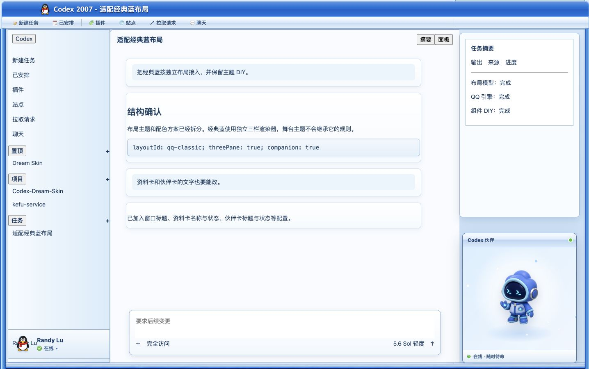
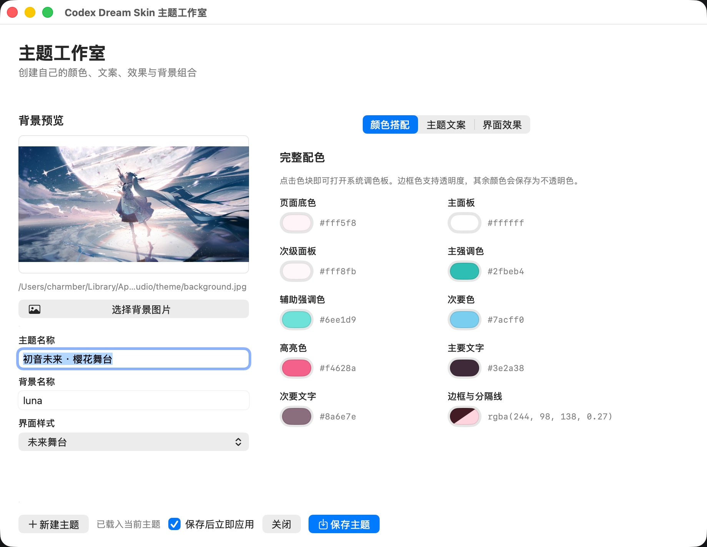
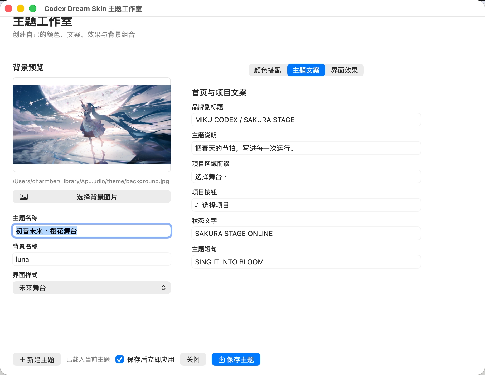
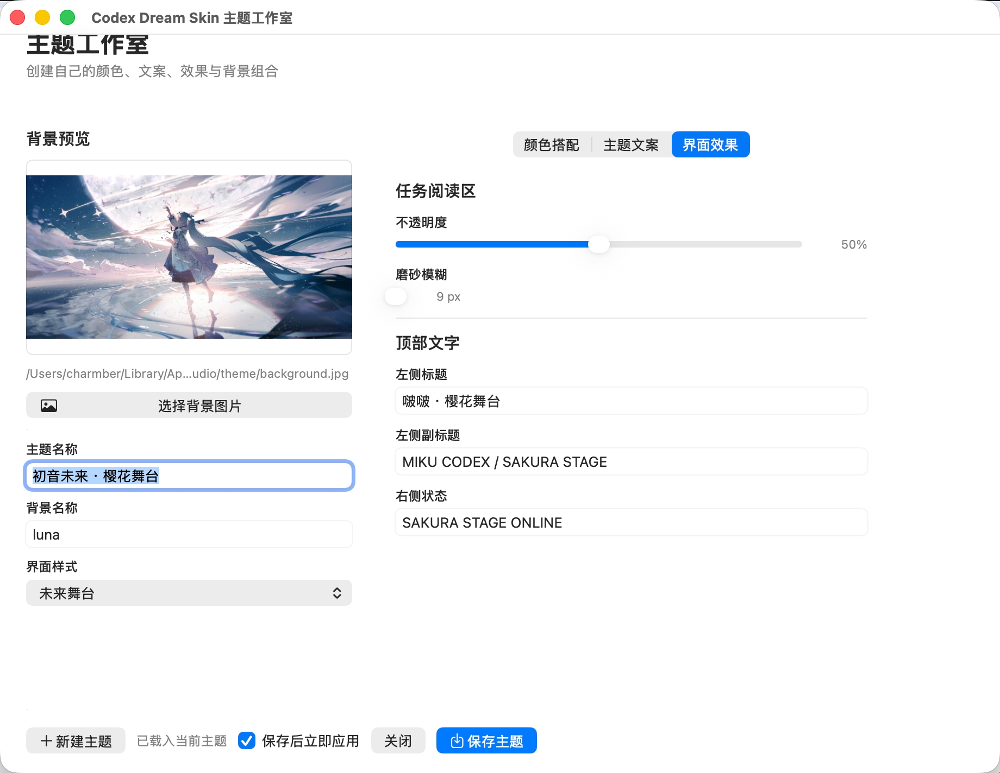
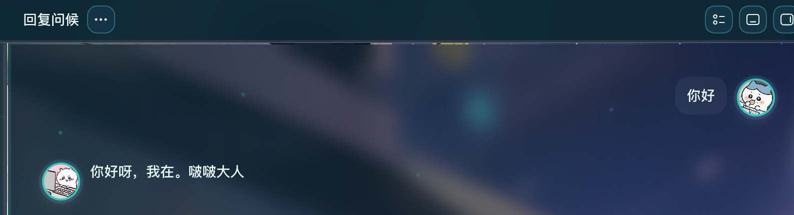
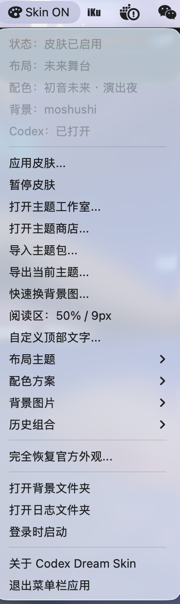

# Codex Skin Codex皮肤

<p align="center">
  <strong>中文</strong> · <a href="./README.en.md">English</a>
</p>

<p align="center">
  <strong>给 Codex 桌面端换一张会呼吸的脸。</strong><br>
  外部主题 / 换肤工具 · 本机 CDP 注入 · 不改官方安装包
</p>

<p align="center">
  一张图，一种心情 · 写代码，也要有氛围感
</p>

<p align="center">
  非 OpenAI 官方产品。不修改 <code>.app</code> / <code>app.asar</code> / WindowsApps。
</p>

## 效果预览

一张图，一种心情。下面都是可落地的主题示意效果：

<p align="center">
  <br>
  <sub>暗黑系列</sub>
</p>

<p align="center">
  <br>
  <sub>樱花舞台</sub>
</p>

<p align="center">
  <br>
  <sub>未来青</sub>
</p>

<p align="center">
  <br>
  <sub>1.9.0 经典蓝 QQ 工作台 · 三栏摘要、伙伴卡与在线资料卡（回归预览）</sub>
</p>

## 1.11 主题商店、主题包与主题工作室

从菜单栏 `Skin → 打开主题工作室…` 即可进入完整的主题创作界面。你可以从当前主题继续编辑，也可以点击「新建主题」从空白配置开始：

菜单栏同时提供 `打开主题商店…`，会在默认浏览器打开 <http://skin.beadplay.cn>，用于浏览、预览、编辑和下载社区主题。商店仅在用户点击后打开，不会自动上传本地主题、账户或 API 配置。当前站点使用 HTTP 明文传输，请勿在其中提交密码、令牌或其他敏感信息。

- 为主题命名，选择并预览关联背景，再选择「未来舞台」或「经典蓝 QQ 工作台」布局主题
- 未来青、演出夜、樱花舞台是「未来舞台」下的配色方案；经典蓝使用独立的 QQ 风格三栏布局和默认配色
- 自定义页面、面板、强调色、文字与边框等 10 项完整配色
- 编辑首页说明、项目入口、状态文字、主题短句和顶部标题
- 分别上传「我的提问」与「Codex 回答」头像，在对话区形成右问左答的圆形头像布局
- 调整任务阅读区的不透明度与磨砂模糊强度
- 在经典蓝的「布局组件」页开关双层标题区、快捷工具栏、三栏摘要、伙伴卡、资料卡和首页角色，并编辑组件文字与宽度
- 保存为可重复使用的独立主题；勾选「保存后立即应用」即可优先热更新当前 Codex

### 导入与导出主题包

从 `Skin` 菜单选择 `导出当前主题...`，即可得到包含主题 JSON、背景和可选头像的 `.cds-theme.zip`；其他用户选择 `导入主题包...` 后即可添加并应用。主题包不包含 JS/CSS，渲染器和主题数据彼此独立，完整格式、字段示例与手工生成方法见 [`macos/THEME_PACKAGE.md`](./macos/THEME_PACKAGE.md)。

### 颜色搭配

颜色面板开放页面底色、主/次面板、主/辅强调色、次要色、高亮色、主/次文字以及边框与分隔线。点击色块使用 macOS 系统调色板，边框色还可调整透明度。

<p align="center">
  <br>
  <sub>完整配色与主题背景预览</sub>
</p>

### 主题文案

主题文案可分别控制品牌副标题、首页主题说明、项目区域前缀、项目按钮、状态文字与主题短句；留空即可隐藏不需要的内容。

<p align="center">
  <br>
  <sub>首页与项目文案设置</sub>
</p>

### 界面效果

界面效果页统一管理任务阅读区透明度、磨砂模糊强度，以及顶部左侧标题、副标题和右侧状态文字。

<p align="center">
  <br>
  <sub>阅读区效果与顶部文字设置</sub>
</p>

### 对话头像

「对话头像」可以分别选择、预览或移除提问头像与回答头像。头像会保存在当前主题中，切换配色或更换背景时继续保留，载入历史主题时随主题一起恢复。

<p align="center">
  <br>
  <sub>我的提问显示在右侧，Codex 回答显示在左侧</sub>
</p>

### 原生菜单栏控制

macOS 13 或更高版本安装 DMG 后，无需 SwiftBar 即可从原生 `Skin` 菜单应用或暂停皮肤、打开主题工作室和主题商店、导入导出主题包、切换布局/配色/背景，以及恢复官方外观。

<p align="center">
  <br>
  <sub>主题创作、分享、切换和恢复入口集中在原生 Skin 菜单</sub>
</p>

### Windows 托盘应用

Windows 版从 1.11.2 起提供安装版与便携版 EXE。托盘菜单和主题工作室补齐同一套布局、配色、背景、头像、界面效果、历史主题与主题包能力；EXE 自带运行时，不要求全局安装 Node.js。


## 它能做什么

- **真·可交互**：侧栏、建议卡、项目选择、输入框都是原生控件，不是整窗假截图贴上去
- **布局与配色分层**：未来舞台和经典蓝 QQ 工作台各自拥有独立布局；配色菜单只显示当前布局兼容的方案
- **经典蓝可 DIY**：可开关标题区、工具栏、三栏、伙伴卡、资料卡与首页角色，并设置组件文字和宽度
- **可换图**：换一张喜欢的纯背景图，不会覆盖已经选择的配色主题
- **完整主题创作**：原生主题工作室可新建主题、预览并关联背景，自定义 10 项颜色、首页/顶部文案、对话头像与阅读区效果
- **可保存再切换**：每次保存都会生成带关联背景的独立主题，之后可从历史组合重新载入
- **可分享主题包**：导出一个无可执行代码的主题 ZIP，其他用户导入即可添加完整主题
- **主题商店入口**：按需在浏览器打开社区主题站点，不会在后台上传本地主题或账户配置
- **原生平台入口**：macOS 菜单栏和 Windows 托盘都可完成主题创作、切换、分享、暂停和恢复
- **可恢复**：一键还原官方外观
- **相对安全**：本机回环 CDP 注入，不改官方二进制与签名

## 快速开始

macOS 13 或更高版本推荐直接从 [GitHub Releases](https://github.com/charmber/codex-skin/releases) 下载 DMG，拖入「应用程序」后首次打开一次，右上角会出现原生 `Skin` 菜单。无需安装 SwiftBar。当前 Release 为未经 Apple 公证的 unsigned 构建，首次启动请按住 Control 点击应用并选择「打开」；不要全局关闭 Gatekeeper。

Windows 10/11 x64 可从同一 Release 下载 `Codex-Dream-Skin-Windows-*-x64.exe`。安装版会创建快捷方式；文件名包含 `portable` 的版本可直接运行。当前 EXE 未签名，SmartScreen 可能显示“未知发布者”，请核对 Release 中的 `SHA256SUMS-Windows.txt`。

**1.安装包安装：**

直接下载release的DMG文件，提示有风险，可以先右键，再点击打开即可安装

如提示这个为正常显示：


从**设置**打开搜索**隐私与安全性**


然后选择仍要打开

然后就可以在搜索栏搜索之后打开了


**2.从源码构建通用 DMG：**

```bash
./macos/scripts/build-dmg.sh --unsigned
```

**3.仓库内也保留了平台脚本作为兼容入口：**

| 平台 | 目录 | 入口 |
|------|------|------|
| Apple Silicon / Intel Mac | [`macos/`](./macos/) | DMG 中的 `Codex Dream Skin.app`；兼容入口为 `.command` 脚本 |
| Windows 10/11 x64 | [`windows/`](./windows/) | `Codex Dream Skin.exe` 托盘应用；PowerShell 脚本为兼容入口 |

更细的说明：

- Mac：[`macos/README.md`](./macos/README.md)
- Windows：[`windows/README.md`](./windows/README.md)
- 路径对照：[`docs/platforms.md`](./docs/platforms.md)
- 项目记录：[`docs/PROJECT.md`](./docs/PROJECT.md)

## 安全边界

- CDP 只绑 `127.0.0.1`，主题运行期间勿跑来路不明的本机程序
- 不修改官方安装目录与代码签名
- **不会**自动改写 API Key、Base URL 或模型供应商设置
- 主题商店只在用户点击后由默认浏览器打开，不会自动上传本地主题、账户或 API 配置
- 主题商店当前使用 HTTP，不提供传输加密；请勿通过该站点提交敏感凭据

## 许可与声明

- 见 [`macos/LICENSE`](./macos/LICENSE)（MIT）与 [`macos/NOTICE.md`](./macos/NOTICE.md)
- 非 OpenAI 官方产品；Codex 及相关权利归其权利人
- 效果图中的人物 / IP 形象仅作主题示意；商用或公开再分发请自行确认肖像权与商标授权

## 维护者

- [charmber](https://github.com/charmber) · `charmber@qq.com`
- 项目地址：<https://github.com/charmber/codex-skin>

---

Star 一下，然后挑一张图，把你的 Codex 变成今天想要的样子。
